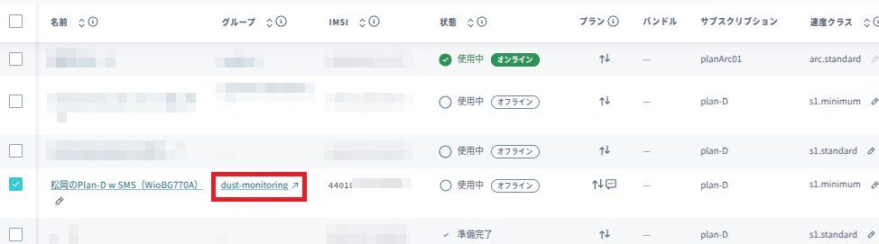

# PM2.5（微小粒子状物質）のモニタリング

大気中のPM2.5（微小粒子状物質）の濃度は、私たちの健康に深刻な影響を及ぼす可能性があります。特に呼吸器や心臓に負担をかけるため、日常生活での対応が重要です。

* [微小粒子状物質（PM2.5）とは](https://www.env.go.jp/air/osen/pm/info.html#ABOUT)（環境省）

しかしながら、この微少粒子状物質は目に見えないため、どれだけ多く浮遊しているのかを把握することができません。
そこで、マイコンボードWio BG770Aとセンサー、SORACOMサービスを使って、可視化してみましょう。

## 1. 製作時間、概算費用

* 必要な時間: 約`TODO`分
* 概要費用: 約`TODO`円

## 2. 必要なもの

|品名|数量|費用|備考|
|:--|:--|:--|:--|
|Wio BG770A|1|約`TODO`円|セルラー通信機能の付いたマイコンボードです。|
|[Grove - HM3301](https://www.seeedstudio.com/Grove-Laser-PM2-5-Sensor-HM3301.html)|1|約5000円|PM2.5などの粒子状物質の濃度を測定するセンサーです。|
|SORACOM IoT SIM plan-D|1|約1000円(*1)|セルラー通信サービスにつなぐSIMです。|
|USB-Cケーブル|1|約1000円|Wio BG770AとPCをつなぐUSBケーブルです。|

*1: 別途、月額利用料が発生します。

## 3. 準備

マイコンボードWio BG770AにSIMとアンテナを取り付けて、センサーを追加します。

### 3-1. SIMを取り付け

Wio BG770AのSIMスロットにSIMを取り付けます。
[Wio BG770A ハードウェアマニュアル](https://seeedjp.github.io/Wiki/Wio_BG770A/hardware.html)の「SIMスロット」を参考に、下記手順を実施してください。

1. SIMスロットの金属カバーをOPEN方向にスライドした後、上方向に開いてください。
2. SIMスロットにnanoSIMを置いてください。その際、nanoSIMの向きに注意してください。（角が欠けている箇所を合わせてください。）
3. 金属カバーを閉じてLOCK方向にスライドしてロックしてください。

### 3-2. アンテナを接続

Wio BG770Aに同封のPCBアンテナを、Wio BG770Aの「LTE」アンテナコネクタに接続してください。

> LTEアンテナコネクタの挿抜回数上限は30回と少ないです。
> できる限り、LTEアンテナを取り付けたままにしてください。

### 3-3. センサーを接続

Grove - HM3301を、Groveケーブルを使ってWio BG770Aの「Grove - I2C」コネクタに接続してください。

## 4. SORACOMサービスの設定

### 4-1. SIMグループを作成

次の設定のSIMグループを作成してください。

* SORACOM Harvest Dataをon
* Unified EndpointをSORACOM Harvest Data

### 4-2. 所属グループを設定

SIMの所属グループを、作成したSIMグループにしてください。

## 5. ソフトウェアの準備

PCにWio BG770Aの開発環境をセットアップして、今回のスケッチが利用するライブラリをインストールします。

### 5-1. Arduino開発環境をインストール

[Wio BG770A クイックスタートガイド](https://seeedjp.github.io/Wiki/Wio_BG770A/quick-start.html)の「開発環境」を参考に、Arduino IDEとSeeedJP nRF52 Boards、WioCellularをインストールしてください。

### 5-2. 追加ライブラリをインストール

[Wio BG770A クイックスタートガイド](https://seeedjp.github.io/Wiki/Wio_BG770A/quick-start.html)の「手順3: WioCellularをインストール」を参考に、Arduino IDEに下記ライブラリをインストールしてください。

* [ArduinoJson](https://docs.arduino.cc/libraries/arduinojson/)
* [GroveDriverPack](https://docs.arduino.cc/libraries/grovedriverpack/)

### 5-3. スケッチをダウンロード

PCにdust-monitoringフォルダを用意して、GitHubから[dust-monitoring.ino]()`TODO`をダウンロードしてください。

## 6. 実行

### 6-1. PCとWio BG770Aを接続

PCとWio BG770AをUSBケーブルで接続してください。

### 6-2. スケッチを開く

Arduino IDEでdust-monitoring.inoを開いてください。

### 6-3. ボードを選択

[Wio BG770A クイックスタートガイド](https://seeedjp.github.io/Wiki/Wio_BG770A/quick-start)の「手順3: blinkスケッチをアップロード」を参考に、ボード選択欄で「Seeed Wio BG770A COMx」を選んでください。

一覧にSeeed Wio BG770Aが表示されないときは、DFUモードへの切り替えが必要です。
[Wio BG770A クイックスタートガイド](https://seeedjp.github.io/Wiki/Wio_BG770A/quick-start)の「手順2: DFUモードに切替」を実施してください。

### 6-4. ボードオプションを設定

Arduino IDEのメニュー「ツール」配下に表示されている下記項目を設定してください。

* Board Version ... "1.0"
* Print Port ... "None"
* SoftDevice ... "S140 7.3.0"

### 6-5. スケッチをアップロード

書き込みボタンをクリックしてください。

スケッチがコンパイルされ、Wio BG770Aへアップロードされます。
アップロードが正常に完了すると、シリアルモニタにログが表示されます。

-> 動画([dust-monitoring.inoをアップロード](media/11.mp4))

### 6-6. 粒子状物質の濃度を確認

粒子状物質の濃度をSORACOM Harvest Dataで確認できるようになりました。

